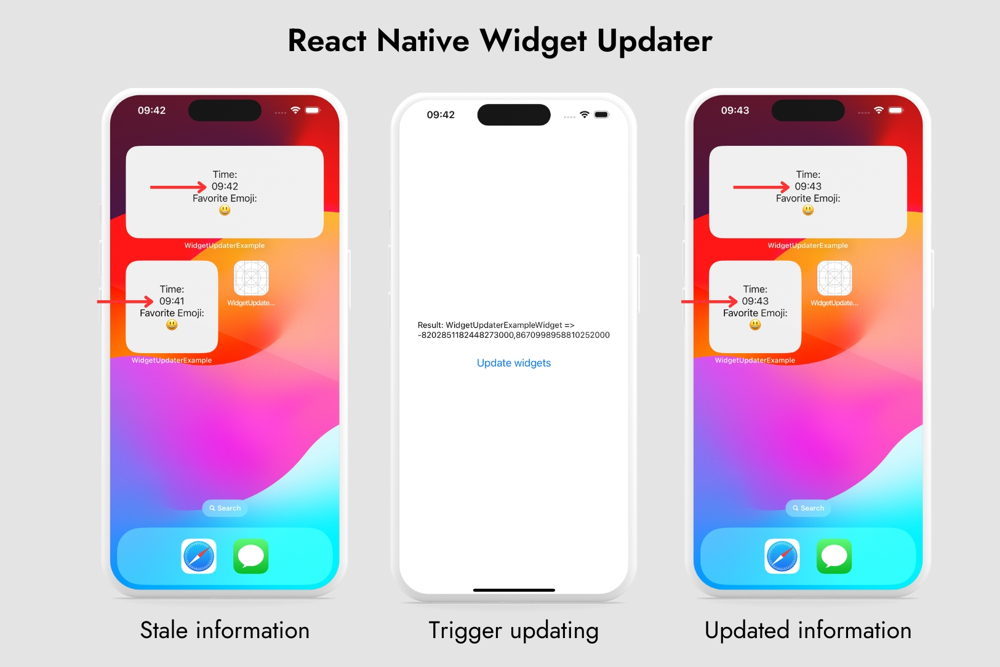

# react-native-widget-updater

Update native home screen and lock screen widgets from JS.

Imagine you want to display an updated entry in your native widget. This package provides the ability to trigger updates.



## Installation

```sh
yarn add react-native-widget-updater
```

or

```sh
npm install react-native-widget-updater
```

## Usage

For all the function calls, a widget class name or kind is required. On iOS this will be the `kind` variable defined in the `Widget` struct, essentially the name of the widget:

```swift
struct WidgetUpdaterExampleWidget: Widget {
  let kind: String = "WidgetUpdaterExampleWidget"
```

On Android it's the class name which extends the `AppWidgetProvider` class:

```kotlin
class ExampleAppWidget : AppWidgetProvider()
```

This needs to prefixed with a dot and becomes `.ExampleAppWidget`.

### Updating widgets

To update a widget from within `react`, call the `updateAppWidgets` function and pass the class names of your widgets.

```js
import { updateAppWidgets } from 'react-native-widget-updater';

// Pass the classes of the app widget
const widgetClasses = ['.ExampleAppWidget'];
await updateAppWidges(widgetClasses);
```

### Gathering in use widgets

To gather all in-use widgets from within `react`, call the `getAppWidgetIds` function and pass the class names of your widgets.

```js
import { getAppWidgetIds } from 'react-native-widget-updater';

// Pass the classes of the app widget
const widgetClasses = ['.ExampleAppWidget'];
const result = await getAppWidgetIds(widgetClasses);
```

This will return a map of widget classes and the corresponding OS ids assigned, e.g. the `.ExampleAppWidget` currently has two instances on the home screen with the ids `18` and `19`.

```js
{
    ".ExampleAppWidget": [18, 19]
}
```

## Contributing

See the [contributing guide](CONTRIBUTING.md) to learn how to contribute to the repository and the development workflow.

## License

MIT
